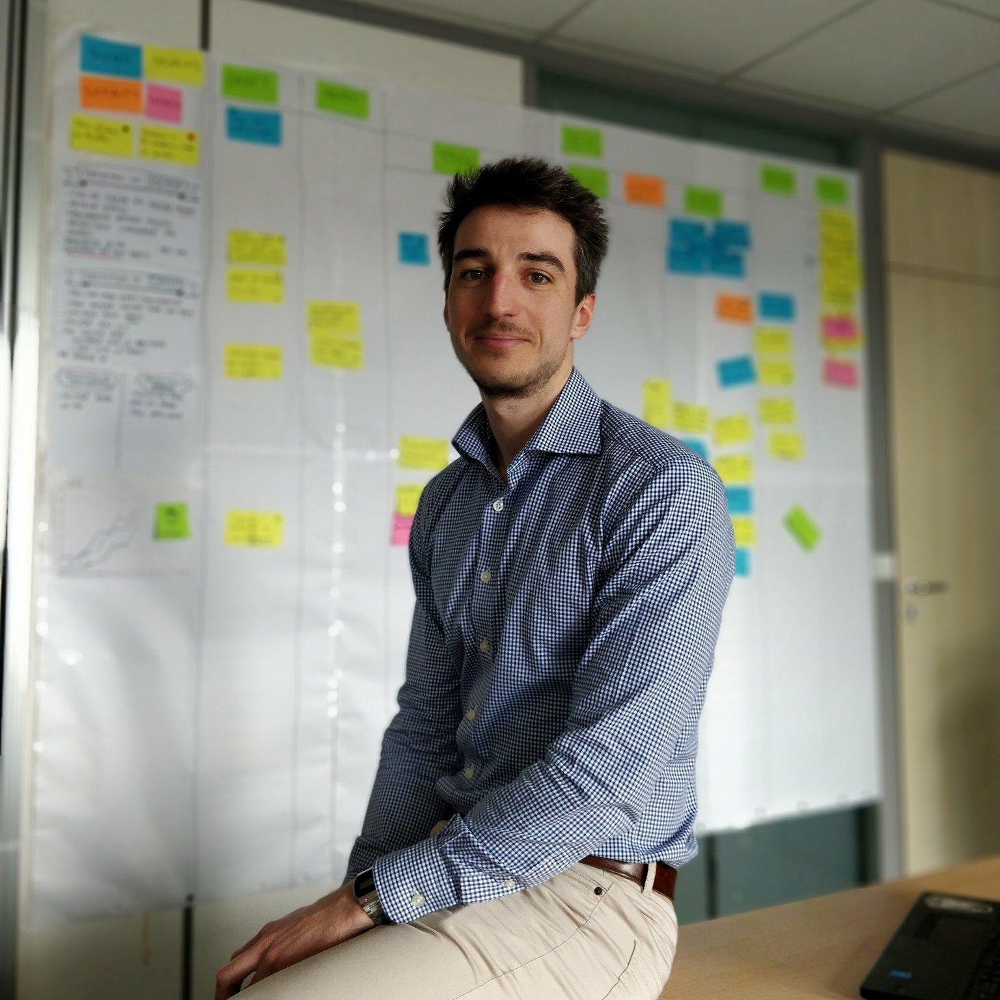

<!-- Main -->

<!-- One -->
<section id="one">
	

		<header class="major">
			<h1>A propos de moi</h1>
		</header>
		

			
			Je ne suis pas très doué pour les descriptions de soi-même, je vais tenter de faire de mon mieux. 
			Je me prénomme <strong>Paul MONNIER</strong>, tout juste sorti de ma formation <strong>EPITECH</strong> Paris (2017). 
			J'ai eu la chance de faire mon stage de fin d'études et de travailler plusieurs mois sous la responsabilité d'un <strong>Software Craftsman</strong>. 
			Cette personne a totalement changé la vision du développement informatique que j'avais en sortie d'études.
			Mis à part toutes les connaissances qu'il m'a apportées c'est surtout l'état d'esprit qu'il m'a transmis qui est le plus important.  
			Je ne vais pas trop m'étaler car lorsqu'il liera ce blog ses chevilles risquent d'enfler :) 
			Ajourd'hui je ne prétends pas être un Software Craftsman car c'est encore tout nouveau pour moi. Cependant j'aime vraiment cet état d'esprit et j'essaierai de m'en rapprocher le plus possible tout au long de ma carrière. 
		

		<h3>Citation Favorite</h3>
		<blockquote>"L'échec est seulement l'opportunité de recommencer d'une façon plus intelligente." <strong>Henry FORD</strong></blockquote>
	

</section>

