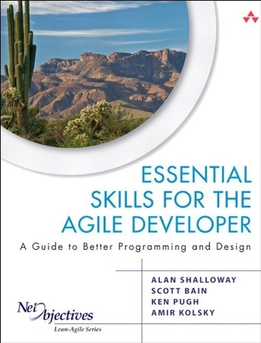
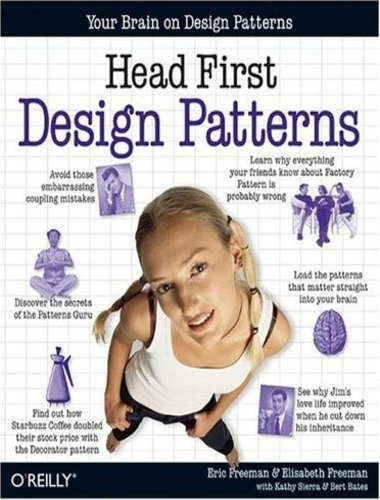
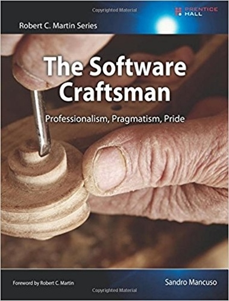

<!-- Main -->

<!-- One -->
<section id="one">
	

		<header class="major">
			<h1>Quelques livres techniques</h1>
		</header>
		

			

				

					<a target="_blank" href="https://www.amazon.fr/Essential-Skills-Agile-Developer-Programming/dp/0321543734/ref=sr_1_1?ie=UTF8&qid=1523826555&sr=8-1&keywords=essential+skills+for+an+agile+developer">Essential Skills for the Agile Developer  De <strong>Allan SHALLOWAY</strong></a>
				

				

					<a target="_blank" href="https://www.amazon.fr/dp/B00AA36RZY/ref=dp-kindle-redirect?_encoding=UTF8&btkr=1">Head First Design Patterns De <strong>Eric FREEMAN & Elisabeth ROBSON</strong></a>
				

				

					<a target="_blank" href="https://www.amazon.fr/dp/B00QXAGIDO/ref=dp-kindle-redirect?_encoding=UTF8&btkr=1">The Software Craftsman De <strong>Sandro MANCUSO</strong></a>
				

			

		

	

</section>

